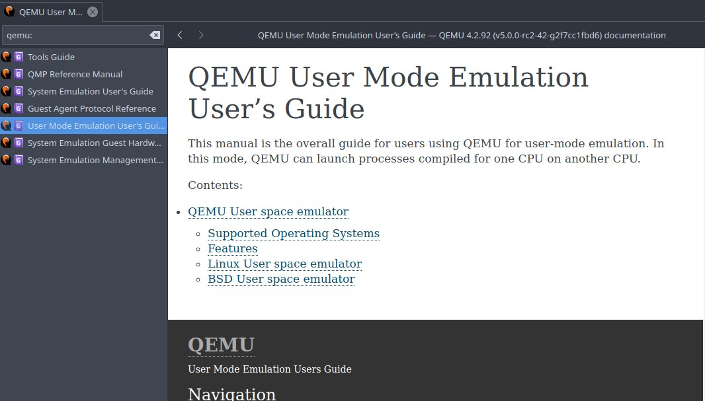

# QEMU Docset

QEMU Docset is a docset for [DashApp] or [ZealDocs]

# Installing

## DashApp:
Install by opening Dash.app > preferences, switch to Downloads, open User Contributed, and search for "QEMU".

## Zeal:
Install by opening Zeal > docsets > add feed:
copy & paste: https://zealusercontributions.now.sh/api/docsets/QEMU.xml or https://zealusercontributions.herokuapp.com/api/docsets/QEMU.xml

# Preview

[DashApp]: http://kapeli.com/dash
[ZealDocs]: https://zealdocs.org
